[](https://github.com/heimgewebe/metarepo/actions/workflows/linkcheck.yml)

# metarepo

Zentrale Steuerzentrale (Meta-Layer) für alle Repos von **heimgewebe**. Dieses Repository liefert Templates, Automatisierungen und Dokumentation, damit Sub-Repos synchron laufen.

> Lizenz: `SPDX-License-Identifier: MIT` – siehe [LICENSE](LICENSE).

## Quick Links
- [Kernkonzepte](docs/konzept-kern.md)
- [WGX-Kommandos](docs/wgx-konzept.md)
- [Fleet-Gesamtbild](docs/heimgewebe-gesamt.md)
- [Repo-Matrix](docs/repo-matrix.md)
- [Contracts & Versionierung](docs/contract-versioning.md)

Weitere visuelle Assets: [Systemdiagramm (Mermaid)](docs/system-overview.mmd) · [Canvas](docs/canvas/) · [Org-Graph](docs/org-graph.mmd).

## Getting started

### Voraussetzungen
- **`just`** – Kommando-Orchestrierung (Installationshinweise siehe [Offizielle `just`-Docs](https://github.com/casey/just)).
- **`uv`** – Python-Tooling-Manager zum Aufsetzen der Abhängigkeiten (`uv sync --frozen`).
- **`yq`** – Wird automatisch über `scripts/tools/yq-pin.sh` gezogen, wenn du `just`-Targets ausführst.

### hausKI-Contributor
1. **Repo klonen** und `uv sync --frozen` oder `just deps` ausführen.
2. `just list` – Überblick über alle angebundenen Repos.
3. `just up` – Templates synchronisieren (Dry-Run optional per `WGX_DRY_RUN=1`).
4. `just smoke` oder `just run target="smoke"` – Fleet-Healthcheck.
5. Lies die Spezialdokumente für hausKI: [Use-Cases](docs/use-cases.md) & [Automation](docs/automation.md).

### semantAH-User / Consumer-Repos
1. `just list` – Prüfe, welche Assets für semantAH bereitstehen.
2. `./scripts/wgx plan --pattern "templates/semantAH/**"` – Vorschau der verfügbaren Artefakte.
3. Für Pull-Learning: `./scripts/sync-templates.sh --pull-from semantAH --pattern "templates/**"`.
4. Referenz: [Docs/contracts/index.md](docs/contracts/index.md) für das `insights`-Schema.

### Tooling-Cheatsheet
- `just help` – Kurzüberblick über die wichtigsten Just-Targets.
- `just up` – Fleet synchronisieren.
- `just wgx_validate` – Konsistenzprüfung gegen WGX.
- `just validate` – lokale Checks (YAML, Formatierungen, etc.).
- `./scripts/wgx plan` – Dry-Run der Template-Verteilung (mit `PLAN_LIMIT=0` für alle Dateien).

## Contributing
Der vollständige Ablauf (Branch-Strategie, lokale Checks, PR-Template) ist in [CONTRIBUTING.md](CONTRIBUTING.md) beschrieben.

Kurzfassung:
- Nutze `just validate` vor jedem Commit.
- Drift & Pull-Learning laufen über `scripts/sync-templates.sh` und `scripts/wgx-doctor`.
- Reports zu Template-Runs landen in [`reports/sync-logs/`](reports/sync-logs/); neuer Report via `just log-sync`.

> Hinweis: Der `/ask`-Server begrenzt den Parameter `k` auf ≤100. Für automatisierte Checks setze `ASK_ENDPOINT_URL` und `METRICS_SNAPSHOT_URL` als Secrets.

## Devcontainer
Siehe [.devcontainer/README.md](.devcontainer/README.md) für die Docker-Socket- und Docker-in-Docker-Varianten. Wähle die gewünschte Variante via `just devcontainer:socket` bzw. `just devcontainer:dind` oder synchronisiere Pins mit `just devcontainer:sync`.

```bash
# Pins aktualisieren und Socket-Variante setzen
just devcontainer:sync
just devcontainer:socket
```

## Contracts (Kurz)
Zentrale Schemas und Reusables liegen im metarepo und werden über Tags (z. B. `contracts-v1`) konsumiert. Details: [docs/contracts/index.md](docs/contracts/index.md)

| Contract | Producer | Consumer |
| --- | --- | --- |
| `aussen.event` | aussensensor, (optional) weltgewebe | leitstand |
| `metrics.snapshot` | wgx | hausKI, leitstand |
| `insights` | semantAH | hausKI, leitstand |
| `audio.events` | hausKI-audio | hausKI, leitstand |
| `policy.decision` | heimlern | hausKI |
| `event.line` | hausKI | leitstand |

## Org-Übersicht
- **Index:** [docs/org-index.md](docs/org-index.md)
- **Graph:** rendere [docs/org-graph.mmd](docs/org-graph.mmd) z. B. in Obsidian/VS Code (Mermaid).

## Dokumentation & Referenzen
- [Docs-Index](docs/README.md) – thematische Übersicht aller Metarepo-Dokumente
- [Systemübersicht](docs/system-overview.md) – Repos, Verantwortlichkeiten & Einstiegspunkte
- [Architektur](docs/architecture.md) – Komponenten, Datenflüsse & Diagramme
- [Use-Cases](docs/use-cases.md) – Schritt-für-Schritt-Beispiele für typische Aufgaben
- [Automatisierung & CI](docs/automation.md) – Just-Targets, WGX-Kommandos & Workflows
- [Umgebung & Secrets](docs/environment.md) – lokale Konfiguration, Tokens & .env-Hinweise
- [Troubleshooting & FAQ](docs/troubleshooting.md) – häufige Probleme & Fixes
- [Events & Contracts](docs/contracts/index.md) – Schemas, Referenzen & Versionierung
- [End-to-End-Läufe](docs/e2e.md) – automatisierte Kette `aussensensor → leitstand → heimlern`

## Codex Playbook (Kurz)
1. Pull-Lernen: `./scripts/sync-templates.sh --pull-from <repo> --pattern "templates/docs/**"`
2. Drift-Report: `./scripts/wgx-doctor --repo <repo>`
3. Push-Kanon: `./scripts/sync-templates.sh --push-to <repo> --pattern "templates/.wgx/profile.yml"`

Tipp: `--dry-run` liefert eine sichere Vorschau; Repos-Liste: `repos.yml` & `--repos-from`.

---

## 🧩 IDEal Snapshot – v0.2 (Stand November 2025)

> **ID²E@l** = *(intelligently developing) intelligent developer environment @ local*
> Die lokale, semantisch vernetzte Entwicklungsumgebung des Heimgewebes.

IDEal beschreibt das Heimgewebe als **autopoietisches System**:
Ein Ensemble aus Modulen, das lokal wahrnimmt, denkt, lernt und sich selbst verbessert.

| Schicht | Modul(e) | Funktion | Haupt-Contracts |
|:--|:--|:--|:--|
| **0 Physisch** | Pop!_OS · systemd · wgx | Substrat · Infrastruktur | – |
| **1 Semantisch** | semantAH | Wissensgraph · Embeddings | `insight.*` |
| **2 Operativ** | hausKI | Planung · Ausführung · Kontrolle | `intent.*`, `plan.*` |
| **3 Reflexiv** | sichter | Diagnose · Review · Selbstkorrektur | `review.*` |
| **4 Memorativ** | leitstand | Persistenz · Audit · Episoden | `aussen.event.*` |
| **5 Politisch-Adaptiv** | heimlern | Policies · Lern-Feedback · Scores | `policy.decision.*` |
| **6 Dialogisch-Semantisch** | mitschreiber | Intent · Kontext · Text-/State-Embeddings | `os.context.*` |

### 🔄 Datenfluss („Semantischer Blutkreislauf“)

mitschreiber → semantAH → hausKI → heimlern → sichter → leitstand → semantAH

Alle Komponenten sind über den **Heimgewebe-Bus** verbunden:
ein lokales JSONL-Eventsystem mit Topics wie
`intent/*`, `graph/*`, `review/*`, `policy/*`, `state/*`, `insight/*`, `error/*`.

---

**Essenz:**
IDEal verschiebt den Fokus von *Dateien* zu *Bedeutungsflüssen.*
Das System co-denkt lokal, lernt aus sich selbst und bleibt offline-souverän.

---

📘 → Weitere Details: [`docs/IDEal_Blueprint.md`](./docs/IDEal_Blueprint.md)
🗺️ → Visuell: [`docs/IDEal_Blueprint.canvas`](./docs/IDEal_Blueprint.canvas)

### 🧬 Systemfluss (IDEal – Semantischer Blutkreislauf v0.2)

```mermaid
flowchart LR
    subgraph L0["0 Physisch"]
        WGX[wgx\n(System-Motorik)]
    end

    subgraph L1["1 Semantisch"]
        SEMANTAH[semantAH\n(Wissensgraph & Embeddings)]
    end

    subgraph L2["2 Operativ"]
        HAUSKI[hausKI\n(Planung & Ausführung)]
    end

    subgraph L3["3 Reflexiv"]
        SICHTER[sichter\n(Diagnose & Review)]
    end

    subgraph L4["4 Memorativ"]
        LEITSTAND[leitstand\n(Audit & Episoden)]
    end

    subgraph L5["5 Politisch-Adaptiv"]
        HEIMLERN[heimlern\n(Policy & Lernfeedback)]
    end

    subgraph L6["6 Dialogisch-Semantisch"]
        MITSCHREIBER[mitschreiber\n(Intent · Kontext · Text/State-Embeddings)]
    end

    %% Flow
    MITSCHREIBER -->|intent/declare| SEMANTAH
    SEMANTAH -->|graph/query| HAUSKI
    HAUSKI -->|policy/decide| HEIMLERN
    HEIMLERN -->|feedback/reward| SICHTER
    SICHTER -->|review/report| LEITSTAND
    LEITSTAND -->|episode → graph/upsert| SEMANTAH

    %% Optional visible grounding
    WGX -.-> HAUSKI

    %% Style colors (GitHub-friendly)
    classDef dialog fill:#c4b5fd,stroke:#6d28d9,color:#111;
    classDef semantisch fill:#bae6fd,stroke:#0284c7,color:#111;
    classDef operativ fill:#fef3c7,stroke:#b45309,color:#111;
    classDef reflexiv fill:#fde68a,stroke:#b45309,color:#111;
    classDef memorativ fill:#bbf7d0,stroke:#15803d,color:#111;
    classDef adaptiv fill:#fed7aa,stroke:#ea580c,color:#111;
    classDef physisch fill:#e5e7eb,stroke:#4b5563,color:#111;

    class MITSCHREIBER dialog;
    class SEMANTAH semantisch;
    class HAUSKI operativ;
    class HEIMLERN adaptiv;
    class SICHTER reflexiv;
    class LEITSTAND memorativ;
    class WGX physisch;
```

### 🕸️ Ereignisfluss & Topics im Heimgewebe (IDEal v0.2.1)

```mermaid
flowchart LR
    %%----------------------------
    %% SCHICHTEN (links)
    subgraph L6["6 Dialogisch-Semantisch"]
        MITSCHREIBER[mitschreiber\nIntent · Kontext · Text-/State-Embeddings]
    end

    subgraph L1["1 Semantisch"]
        SEMANTAH[semantAH\nGraph · Relationen · Embeddings]
    end

    subgraph L2["2 Operativ"]
        HAUSKI[hausKI\nPlanung · Simulation · Ausführung]
    end

    subgraph L5["5 Politisch-Adaptiv"]
        HEIMLERN[heimlern\nPolicy · Lernfeedback · Scores]
    end

    subgraph L3["3 Reflexiv"]
        SICHTER[sichter\nDiagnose · Review · Selbstkorrektur]
    end

    subgraph L4["4 Memorativ"]
        LEITSTAND[leitstand\nEpisoden · Audit · Metriken]
    end

    subgraph L0["0 Physisch"]
        WGX[wgx\nSystem-Motorik · Automation]
    end

    %%----------------------------
    %% TOPICS (rechts)
    subgraph T["Event-Topics (Heimgewebe-Bus)"]
        T_INTENT[intent/*]
        T_GRAPH[graph/*]
        T_POLICY[policy/*]
        T_REVIEW[review/*]
        T_STATE[state/*]
        T_INSIGHT[insight/*]
        T_ERROR[error/*]
    end

    %%----------------------------
    %% FLOWS
    MITSCHREIBER -->|intent/declare| T_INTENT
    T_INTENT --> SEMANTAH

    SEMANTAH -->|graph/query| T_GRAPH
    T_GRAPH --> HAUSKI

    HAUSKI -->|policy/decide| T_POLICY
    T_POLICY --> HEIMLERN

    HEIMLERN -->|feedback/reward| T_REVIEW
    T_REVIEW --> SICHTER

    SICHTER -->|review/report| T_STATE
    T_STATE --> LEITSTAND

    LEITSTAND -->|episode → provenance/upsert| T_INSIGHT
    T_INSIGHT --> SEMANTAH

    %% Fehlerfluss (global)
    WGX -.->|system/error| T_ERROR
    T_ERROR -.-> SICHTER

    %%----------------------------
    %% STYLE CLASSES
    classDef dialog fill:#c7d2fe,stroke:#4f46e5,color:#111;
    classDef semantisch fill:#bfdbfe,stroke:#2563eb,color:#111;
    classDef operativ fill:#fde68a,stroke:#b45309,color:#111;
    classDef adaptiv fill:#fed7aa,stroke:#ea580c,color:#111;
    classDef reflexiv fill:#fcd34d,stroke:#b45309,color:#111;
    classDef memorativ fill:#bbf7d0,stroke:#15803d,color:#111;
    classDef physisch fill:#e5e7eb,stroke:#4b5563,color:#111;
    classDef topic fill:#f9fafb,stroke:#94a3b8,color:#111,font-size:11px;

    class MITSCHREIBER dialog;
    class SEMANTAH semantisch;
    class HAUSKI operativ;
    class HEIMLERN adaptiv;
    class SICHTER reflexiv;
    class LEITSTAND memorativ;
    class WGX physisch;

    class T_INTENT,T_GRAPH,T_POLICY,T_REVIEW,T_STATE,T_INSIGHT,T_ERROR topic;
```


