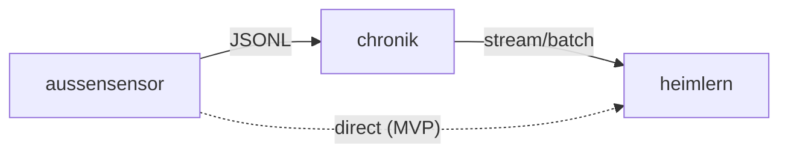

## Datenfluss: aussensensor → chronik → heimlern

**MVP (heute):** `aussensensor` pusht an `chronik` **und** direkt an `heimlern` (Skripte).
**Zielbild:** ingest **nur** via `chronik`; `heimlern` konsumiert von dort (Stream/Webhook/Batch).

**Migrationsnotiz:** Direktpfad ist **Übergang**. Neue Producer richten ingest ausschließlich auf `chronik` aus.
