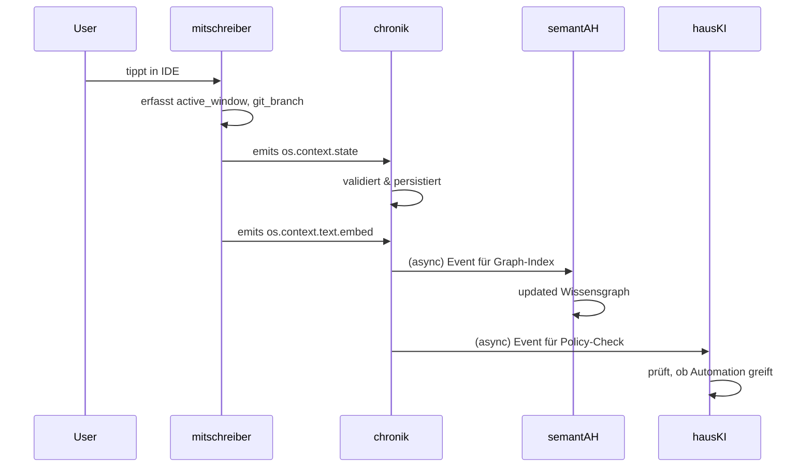

# Contract: `os.context.*` (mitschreiber)

> **Producer:** `mitschreiber` (OS-Kontext-Daemon)

Diese Events erfassen den **unmittelbaren Nutzungskontext** am Rechner (OS-Ebene).

-   **`os.context.intent`**: Was der Nutzer *vorhatte*.
-   **`os.context.state`**: Welcher Zustand gerade *herrscht*.
-   **`os.context.text.embed`**: Text-Repräsentation des Zustands.

## Datenfluss
🪶 **mitschreiber** (OS-Kontext-Daemon) → **chronik** → **semantAH** / **hausKI** / **heimlern**.

## Anwendungsfälle
-   **Proaktive Assistenz**: `hausKI` erkennt wiederkehrende Muster.
-   **Automatisierung**: sich wiederholende Aktionen.
-   **Wissens-Graph**: `semantAH` verknüpft Kontext mit Dokumenten.
-   **Lernen**: `heimlern` nutzt Kontext als Feature für Entscheidungen.

## Sicherheit & Privacy
-   **Sensibel**: `mitschreiber`-Events sind hochsensibel (Tastatureingaben, Bildschirminhalte).
-   **Lokal**: Events verlassen nie die lokale Maschine, außer explizit via `wgx` exportiert.
-   **Anonymisierung**: Personenbezogene Daten werden vor dem Export gefiltert.
-   **Audit-fähig**: chronik protokolliert alle Annahmen, Ablehnungen und TTL-Löschungen.

---

## Detail: `os.context.intent.schema.json`

**Ziel:** Eine klare Absicht des Nutzers erfassen, z.B. „recherchiere X“ oder „schreibe an Y“.

```json
{
  "type": "object",
  "properties": {
    "intent": { "type": "string", "description": "Die Absicht, z.B. 'research.topic'" },
    "payload": { "type": "object", "description": "Kontext-Daten zur Absicht" }
  },
  "required": ["intent"]
}
```

---

## 5-Phasen-Modell (Beispiel `mitschreiber`-Event)
1.  **Capture**: `mitschreiber`-Daemon erfasst `active_window`, `clipboard`, `key_freq`.
2.  **Enrich**: Anreicherung mit `git_repo`, `project_context` aus lokalem `ai-context.yml`.
3.  **Emit**: Event wird als `os.context.state` in lokales JSONL geschrieben.
4.  **Ingest**: `chronik` liest, validiert, persistiert.
5.  **Audit-Trail** im `chronik`:
    -   `event.accepted`
    -   `event.rejected` (Schema-Verletzung)
    -   `event.ttl.expired`

## Event-Beispiel-Flow


