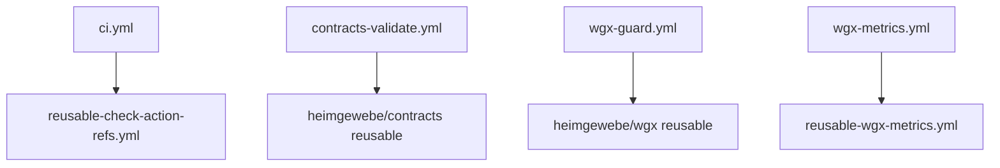

# Workflow-Katalog

Übersicht über alle GitHub Actions Workflows im metarepo.

## Hauptworkflows

### CI/CD

| Workflow | Beschreibung | Trigger | Status |
|----------|--------------|---------|--------|
| **ci.yml** | Haupt-CI-Pipeline: Rust, Python, Node.js Tests | Push (main), PR, Schedule | ✅ Aktiv |
| **agents-ci.yml** | Template-Validierung für agent-kit | Push/PR auf `templates/agent-kit/**` | ✅ Aktiv |
| **heavy.yml** | Schwere Integration-Tests (z.B. /ask endpoint) | Schedule (alle 6h), Manual | ✅ Aktiv |

### Validierung & Guards

| Workflow | Beschreibung | Trigger | Status |
|----------|--------------|---------|--------|
| **wgx-guard.yml** | WGX-Profil-Validierung (reusable von heimgewebe/wgx) | Push, PR | ✅ Aktiv |
| **ai-context-guard.yml** | Prüft Existenz von .ai-context.yml | Push (main), PR auf `.ai-context.yml` | ✅ Aktiv |
| **toolchain-guard.yml** | Validiert toolchain.versions.yml und Workflow-Refs | Push | ✅ Aktiv |
| **contracts-validate.yml** | Contract-Schema-Validierung mit Deletion Policy | Push/PR auf `json/**`, `proto/**` | ✅ Aktiv |
| **validate-templates.yml** | Template-Struktur-Validierung | Push/PR auf `templates/**` | ✅ Aktiv |

### Dokumentation

| Workflow | Beschreibung | Trigger | Status |
|----------|--------------|---------|--------|
| **docs-linkcheck.yml** | Link-Validierung mit lychee (scheduled) | Schedule (täglich 3:00), Manual | ✅ Aktiv |
| **linkcheck.yml** | Link-Validierung mit lychee (CI, custom install) | Push (main), PR auf docs/README | ✅ Aktiv |
| **adr-lint.yml** | ADR-Dokumentations-Lint | Push/PR auf `docs/adrs/**` | ✅ Aktiv |
| **render-diagrams.yml** | Diagram-Rendering (Mermaid, etc.) | Push/PR auf Diagram-Dateien | ✅ Aktiv |

**Hinweis:** Zwei Linkcheck-Workflows existieren mit unterschiedlichen Zwecken:
- `linkcheck.yml` läuft bei jedem Push/PR und nutzt ein custom Install-Script
- `docs-linkcheck.yml` läuft scheduled und nutzt die lychee-action direkt

### Metriken & Monitoring

| Workflow | Beschreibung | Trigger | Status |
|----------|--------------|---------|--------|
| **wgx-metrics.yml** | WGX-Fleet-Metriken | Push/PR, Schedule, Manual | ✅ Aktiv |
| **metrics.yml** | Allgemeine Repository-Metriken | Push/PR, Manual | ✅ Aktiv |
| **wgx-smoke.yml** | WGX-Smoke-Tests | Push/PR | ✅ Aktiv |
| **impact-check.yml** | Dependency-Impact-Analyse | Push/PR auf dependency files | ✅ Aktiv |
| **metarepo-analyze.yml** | Repository-Struktur-Analyse | Push/PR, Manual | ✅ Aktiv |

### Spezial-Workflows

| Workflow | Beschreibung | Trigger | Status |
|----------|--------------|---------|--------|
| **heimgewebe-command-dispatch.yml** | Command Dispatcher für Fleet-Operationen | workflow_dispatch | ✅ Aktiv |
| **pr-heimgewebe-commands.yml** | PR-Command-Handler (z.B. `/validate`) | PR comments | ✅ Aktiv |
| **org-assets.yml** | Organisation-Assets-Generierung | Push/PR, Schedule, Manual | ✅ Aktiv |
| **net-probe.yml** | Netzwerk-Verfügbarkeits-Tests | Schedule, Manual | ✅ Aktiv |
| **ci-shellcheck.yml** | Shell-Script-Linting | Push/PR auf shell scripts | ✅ Aktiv |

## Wiederverwendbare Workflows

Diese Workflows sind nicht direkt ausführbar, sondern werden von anderen Workflows aufgerufen:

| Workflow | Beschreibung | Verwendet von |
|----------|--------------|---------------|
| **reusable-ci.yml** | Generische CI-Pipeline (just-basiert) | Downstream-Repos |
| **reusable-check-action-refs.yml** | Prüft @main Referenzen in Actions | ci.yml |
| **reusable-validate-jsonl.yml** | JSONL-Validierung | Downstream-Repos |
| **reusable-wgx-metrics.yml** | WGX-Metriken-Sammlung | wgx-metrics.yml |

## Workflow-Dependencies

## Trigger-Übersicht

### Bei jedem Push/PR
- ci.yml (mit Path-Filter)
- wgx-guard.yml
- validate-templates.yml (mit Path-Filter)
- contracts-validate.yml (mit Path-Filter)

### Bei Schedule
- ci.yml (täglich 3:17)
- docs-linkcheck.yml (täglich 3:00)
- heavy.yml (alle 6 Stunden)

### Nur Manual (workflow_dispatch)
- heimgewebe-command-dispatch.yml
- heavy.yml
- org-assets.yml
- net-probe.yml
- und weitere...

## Best Practices in den Workflows

### Sicherheit
- ✅ Actions auf Tags/SHAs gepinnt (siehe [github-actions-pinning.md](policies/github-actions-pinning.md))
- ✅ `permissions: contents: read` als Default
- ✅ `persist-credentials: false` wo möglich
- ✅ SHA-256 Checksummen für externe Downloads

### Performance
- ✅ Multi-Layer Caching (Cargo, uv, npm, Playwright)
- ✅ `concurrency.group` mit `cancel-in-progress`
- ✅ Matrix-Builds für Parallelisierung
- ✅ Conditional Steps für optionale Features

### Fehlerbehandlung
- ✅ Artifacts bei Fehlern hochladen
- ✅ Sinnvolle Timeouts (5-40 min)
- ✅ `fail-fast: false` in Matrix-Builds
- ✅ Guards für fehlende Dependencies

### Wartbarkeit
- ✅ Strikte Shell-Einstellungen (`bash -euo pipefail`)
- ✅ Zentrale Toolchain-Versionierung
- ✅ Reusable Workflows
- ✅ Gute Kommentare

## Nächste Schritte

Siehe [workflow-quality-assessment.md](./workflow-quality-assessment.md) für:
- Detaillierte Qualitätsbewertung
- Verbesserungsvorschläge
- Priorisierte Action Items

## Wartung

### Monatlich
- [ ] Dependency Updates (Dependabot PRs reviewen)
- [ ] Action-Version-Updates prüfen
- [ ] Failed Workflows analysieren

### Quarterly
- [ ] Workflow-Metriken reviewen
- [ ] Neue Best Practices evaluieren
- [ ] Unused Workflows archivieren

---

**Letzte Aktualisierung:** 2024-11-30  
**Maintainer:** Heimgewebe Fleet Team
